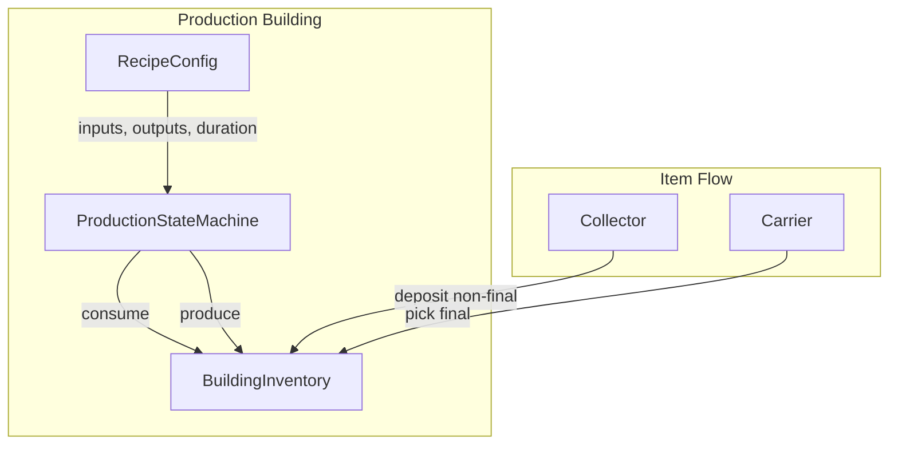
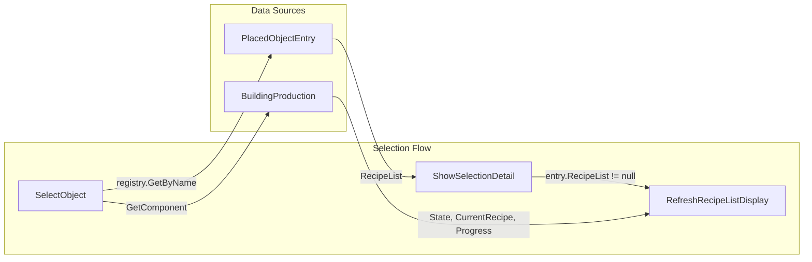

# Building Production Tree Plan

## Overview

Buildings produce items based on a **recipe list** when source items are available. Each building can have one or more recipes: consume inputs from its inventory, run for a configurable duration, produce outputs. Integrates with the actor system: Collectors bring non-final items; Carriers pick final items; production outputs feed into this flow.

---

## Current State

- **BuildingInventory**: Per-building, per-item capacity. `AddItem`, `RemoveItem`, `GetCount`, `HasSpaceFor(Item, int)`, `TryTake`.
- **ItemDefinition.IsFinal**: Final items → Carriers pick ASAP. Non-final → Collectors only; Carriers take when building full.
- **Actors**: Gatherers produce into building inventory; Collectors pick non-final from buildings; Carriers pick final (and non-final when full) and deposit to warehouse.
- **No production logic**: Buildings do not consume inputs or produce outputs autonomously.

---

## Requirements


| Requirement         | Description                                                                              |
| ------------------- | ---------------------------------------------------------------------------------------- |
| **Recipe list** | Configurable input/output per recipe                                                     |
| **State machine**   | Idle, Producing, Blocked (missing inputs), etc.                                          |
| **Timing**          | Work duration per recipe                                                                 |
| **Input/output**    | Consume source items; produce output items into building inventory                       |
| **Integration**     | Collectors pick non-final; Carriers pick final. Production outputs feed into actor flow. |


---

## Architecture




---

## Data Model

### RecipeConfig (ScriptableObject)

```csharp
[CreateAssetMenu(menuName = "Voxel/Production/Recipe")]
public class RecipeConfig : ScriptableObject
{
    public string Name;                    // e.g. "Bake Bread"
    public (Item item, int count)[] Inputs;   // e.g. (Flour, 2), (Wheat, 1)
    public (Item item, int count)[] Outputs;  // e.g. (Bread, 1)
    public float WorkDurationSeconds;      // e.g. 5f
}
```

### RecipeListConfig (ScriptableObject)

One per building type. Holds ordered list of recipes.

```csharp
[CreateAssetMenu(menuName = "Voxel/Production/Production Tree")]
public class RecipeListConfig : ScriptableObject
{
    public RecipeConfig[] Recipes;  // Ordered; first match with available inputs runs
}
```

### PlacedObjectEntry Extension

```csharp
[Header("Production")]
public RecipeListConfig RecipeList;  // When set, building runs production
```

---

## State Machine


| State         | Condition                                                                   | Transition                                            |
| ------------- | --------------------------------------------------------------------------- | ----------------------------------------------------- |
| **Idle**      | No recipe has sufficient inputs                                             | Check recipes each tick                               |
| **Producing** | Recipe running                                                              | Timer → complete → consume inputs, add outputs → Idle |
| **Blocked**   | Recipe selected but inputs missing (e.g. taken by collector mid-production) | Retry or cancel → Idle                                |


**Recipe selection**: User selects recipe in sidebar; only 1 active at a time. Building runs selected recipe when inputs and output space available.

---

## Implementation Plan

### Phase 1: Domain Layer (Pure)

1. **RecipeConfig** — ScriptableObject: Inputs, Outputs, WorkDurationSeconds
2. **RecipeListConfig** — ScriptableObject: RecipeConfig[]
3. **ProductionService** (pure) — `bool CanRun(RecipeConfig, IReadOnlyInventory)` (inputs present + `HasSpaceFor` outputs), `void Execute(RecipeConfig, IInventory)` (consume + add)
4. **ProductionState** (struct or class) — CurrentRecipe, Timer, State enum

### Phase 2: Building Production Component

1. **BuildingProduction** (MonoBehaviour) — Attached to buildings with RecipeList
  - References: BuildingInventory, RecipeListConfig
  - Selected recipe index (user picks in sidebar; persisted)
  - Update loop: state machine tick; only run selected recipe when `CanRun` (inputs + output space)
  - On produce: `inventory.AddItem(output, count, emitUnitProduced: true)` for floating text (reuse existing system)
2. **PlacementExecutor / PlacedObjectPersistence** — Add BuildingProduction when `entry.RecipeList != null`

### Phase 3: PlacedObjectEntry Integration

1. Add `RecipeListConfig RecipeList` to PlacedObjectEntry
2. Breadery, Mill, Beerery, etc. — assign recipe lists

### Phase 4: Persistence

1. **ProductionSaveData** — Building position, selected recipe index, current recipe index (when Producing), timer remaining
2. **PlacedObjectPersistence** — Save/load production state with building inventories

### Phase 5: Production Tree UI (Sidebar / Building Detail)

Recipe list display in the sidebar's SelectionDetail (building detail panel) when a production building is selected. The section is shown only when `entry.RecipeList != null`; otherwise it follows the same hide pattern as InventorySection for `UsesGlobalStorage`.

#### UI Requirements


| Element                     | Description                                                                                  |
| --------------------------- | -------------------------------------------------------------------------------------------- |
| **Recipe list section** | New section in SelectionDetail, shown only when `entry.RecipeList != null`               |
| **Section header**          | "Production" label, styled like `inventory-category-header`                                  |
| **State indicator**         | Idle / Producing / Blocked badge with distinct styling                                       |
| **Recipe list**             | For each recipe: name, inputs, outputs, duration; user selects which recipe to run (clickable) |
| **Progress**                | When Producing: progress bar or timer text (e.g. "3.2s / 6s")                                |
| **Refresh**                 | Update when production state changes; avoid jank when timer ticks                            |


#### Context

- **Sidebar**: Right panel containing Menu, PlacementButtons, SelectionDetail ([HUD.uxml](Assets/Features/UI/Markup/HUD.uxml))
- **SelectionDetail**: Shown when a selectable building is clicked; contains SelectionHeader, InventorySection, Locate, DebugSection
- **Selection flow**: `SelectObject` caches `BuildingInventory` via `GetComponent`; `ShowSelectionDetail` uses `registry.GetByName(name)` for entry config; `RefreshInventoryDisplay` rebuilds inventory UI; `InventoryChanged` triggers refresh

#### Data Flow




#### HUD.uxml Changes

Add `RecipeListSection` inside SelectionDetail, between InventorySection and Locate (same order as other sections):

```xml
<ui:VisualElement name="RecipeListSection" class="hidden"/>
```

Placement: after `InventorySection`, before `Locate`. Section starts with `class="hidden"`; SelectionController removes it when recipe list is present.

#### HUD.uss Styles


| Selector                      | Purpose                                                                                         |
| ----------------------------- | ----------------------------------------------------------------------------------------------- |
| `#RecipeListSection`      | Base container: `flex-direction: column`, `padding-top/bottom: 5px`, mirror `#InventorySection` |
| `.production-header`          | Section title "Production"; reuse `inventory-category-header`                                   |
| `.production-state-row`       | Row for state badge + optional progress                                                         |
| `.production-state-idle`      | Idle state color (e.g. muted gray)                                                              |
| `.production-state-producing` | Producing state color (e.g. green)                                                              |
| `.production-state-blocked`   | Blocked state color (e.g. orange)                                                               |
| `.production-recipe-row`      | Single recipe: name, inputs, outputs, duration; clickable                                        |
| `.production-recipe-selected` | Highlight for selected recipe                                                                  |
| `.production-progress-bar`    | Progress bar container (height ~4px, background dark)                                           |
| `.production-progress-fill`   | Fill element, width % based on `ProgressNormalized`                                             |


Reuse `inventory-row`, `inventory-icon`, `inventory-count` for item icons and counts in recipe rows.

#### SelectionController Changes

1. **Cache**: Add `private BuildingProduction _cachedProduction;` and `private VisualElement _recipeListSection;`
2. **Query**: In `Start`, add `_recipeListSection = uiDocument.rootVisualElement.Q<VisualElement>("RecipeListSection");`
3. **SelectObject**: After caching `_cachedInventory`, add:

```csharp
   _cachedProduction = obj != null ? obj.GetComponent<BuildingProduction>() : null;
   if (_cachedProduction != null)
       _cachedProduction.StateChanged += OnProductionStateChanged;


```

1. **ShowSelectionDetail**: After inventory section show/hide logic, add:

```csharp
   if (_recipeListSection != null)
   {
       bool showProduction = entry?.RecipeList != null;
       if (showProduction)
       {
           _recipeListSection.RemoveFromClassList("hidden");
           RefreshRecipeListDisplay();
       }
       else
           _recipeListSection.AddToClassList("hidden");
   }


```

5. **RefreshRecipeListDisplay**: Clear `_recipeListSection`, iterate `entry.RecipeList.Recipes`, build clickable rows for each recipe (name, inputs, outputs, duration). On click, set `_cachedProduction.SelectedRecipeIndex = i`. If `_cachedProduction != null`, add state row (Idle/Producing/Blocked) and progress bar when Producing. Highlight selected recipe. Use `itemRegistry.GetDefinition(item)` for sprites and display names.
6. **OnProductionStateChanged** and **OnInventoryChanged**: Both call `RefreshRecipeListDisplay()` when production section visible (production completion adds to inventory).
7. **UnsubscribeFromInventory** (rename to `UnsubscribeFromSelection` or extend): Unsubscribe `_cachedProduction.StateChanged -= OnProductionStateChanged`; set `_cachedProduction = null`.
8. **RefreshSelectionDisplay**: Add `RefreshRecipeListDisplay()` when `_recipeListSection` is visible.

#### BuildingProduction API for UI

```csharp
public enum ProductionState { Idle, Producing, Blocked }

public int SelectedRecipeIndex { get; set; }  // User picks in sidebar
public ProductionState State { get; }
public RecipeConfig CurrentRecipe { get; }  // null when Idle
public float ProgressNormalized { get; }    // 0..1 when Producing
public float TimerRemaining { get; }        // seconds left when Producing

public event Action StateChanged;  // Invoke when state changes or progress updates
```

`StateChanged` should fire when: transitioning Idle→Producing, Producing→Idle, Producing→Blocked; and optionally on timer tick (e.g. every 0.5s) for smooth progress bar. Alternative: UI polls every 0.5s when selected and Producing.

#### Refresh Strategy

- **StateChanged**: `BuildingProduction` invokes on state transitions (and optionally on timer tick for progress bar). SelectionController subscribes and calls `RefreshRecipeListDisplay`.
- **InventoryChanged**: Production completion adds to inventory; existing subscription already triggers `RefreshInventoryDisplay`. Extend to also call `RefreshRecipeListDisplay` when production section visible.

#### Edge Cases

- Buildable selected but destroyed: `ClearSelection` clears `_cachedProduction`; no null ref if we check `_selectedObject != null` before refresh.
- BuildingProduction removed at runtime: Unsubscribe in `ClearSelection`; `OnProductionStateChanged` may fire once if object is destroyed—guard with null check.

#### Visual Layout (SelectionDetail order)

1. SelectionHeader (icon + name)
2. InventorySection
3. **RecipeListSection** (new)
4. Locate
5. DebugSection

RecipeListSection content: header "Production", state row (badge + progress bar when Producing), recipe rows (one per recipe).

---

## Recipe Examples


| Building   | Recipe      | Inputs            | Outputs | Duration |
| ---------- | ----------- | ----------------- | ------- | -------- |
| Mill       | Grind Wheat | Wheat 2           | Flour 1 | 4s       |
| Breadery   | Bake Bread  | Flour 2, Wheat 1  | Bread 1 | 6s       |
| Beerery    | Brew Beer   | Hops 1, Wheat 2   | Beer 1  | 8s       |
| Blacksmith | Forge Sword | IronBar 2, Wood 1 | Sword 1 | 10s      |


---

## Integration with Actor System

- **Collectors**: Pick non-final items (Flour, IronOre, etc.) from producer buildings, deposit to buildings that need them (e.g. Breadery gets Flour from Mill). Production consumes these.
- **Carriers**: Pick final items (Bread, Sword, Beer) from building inventory, deposit to warehouse. Production produces these.
- **ItemDefinition.IsFinal**: Mark Bread, Sword, Beer as final; Flour, IronOre, Wheat as non-final.
- **Building full**: Do not start production if no room for outputs. Carriers pick final items to free space.

---

## File Summary


| File                         | Action                                                                                                              |
| ---------------------------- | ------------------------------------------------------------------------------------------------------------------- |
| `RecipeConfig.cs`            | New — ScriptableObject                                                                                              |
| `RecipeListConfig.cs`    | New — ScriptableObject                                                                                              |
| `ProductionService.cs`       | New — Pure domain (can run, execute)                                                                                |
| `BuildingProduction.cs`      | New — MonoBehaviour, state machine; expose State, CurrentRecipe, Progress for UI                                    |
| `PlacedObjectEntry.cs`       | Add RecipeList                                                                                                  |
| `PlacementExecutor.cs`       | Add BuildingProduction when RecipeList set                                                                      |
| `PlacedObjectPersistence.cs` | Save/load production state                                                                                          |
| `ProductionSaveData.cs`      | New — Struct for persistence                                                                                        |
| `HUD.uxml`                   | Add RecipeListSection (between InventorySection and Locate)                                                     |
| `HUD.uss`                    | Add RecipeListSection, production-header, state, recipe, progress styles                                        |
| `SelectionController.cs`     | Cache BuildingProduction, RecipeListSection; show/hide; RefreshRecipeListDisplay; StateChanged subscription |


---

## Decisions

| Topic | Decision |
|-------|----------|
| **Multiple recipes** | Recipe selectable in sidebar; always run 1 at a time |
| **Output overflow** | Do not start production if no room for outputs |
| **Visual feedback** | Floating text only; reuse existing system |
| **Recipe priority** | Only 1 active recipe; user selects in sidebar |
| **Production UI refresh** | StateChanged and InventoryChanged both trigger refresh |

